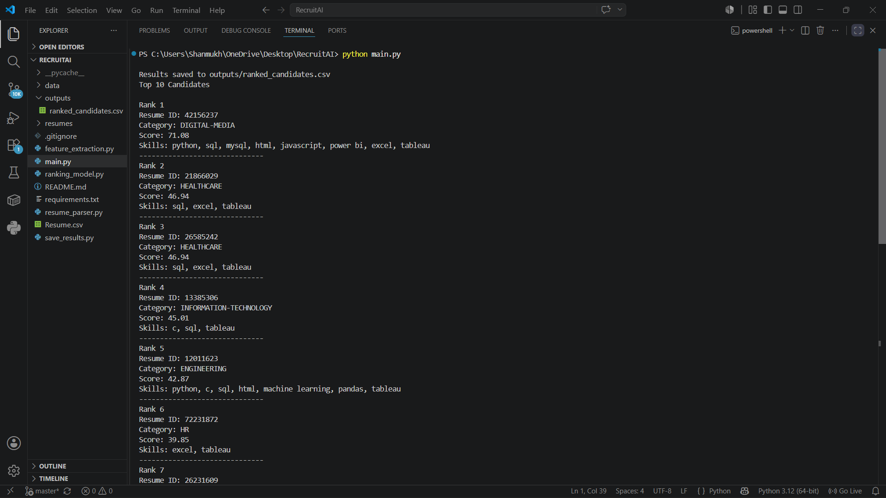
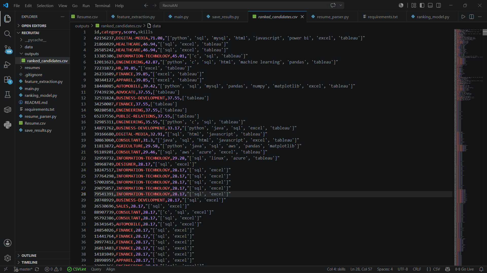

# RecruitAI – NLP-Based Resume Screening & Candidate Ranking System

RecruitAI is an NLP-based resume screening system that automates candidate ranking by matching resumes against a job description. It extracts technical skills from resumes and job descriptions, computes similarity scores using TF-IDF Vectorization and Cosine Similarity, and ranks candidates based on their relevance.

The project demonstrates how Natural Language Processing (NLP) techniques can automate the initial resume shortlisting process.

---

## Project Demo

### Terminal Output



### Ranked Candidates



---

## Features

+- Process and rank **2,484 resumes** from a resume dataset
- Extract technical skills using Regular Expressions (Regex)
- Extract required skills from a job description
- Generate TF-IDF vectors for resume-job matching
- Compute similarity scores using Cosine Similarity
- Rank candidates based on job relevance
- Display the Top 10 matching candidates
- Export ranked candidate results to a CSV file

---

## Technical Approach

The project follows the pipeline below:

1. Load resumes from the dataset (`Resume.csv`)
2. Extract predefined technical skills from each resume
3. Extract technical skills from the job description
4. Convert extracted skills into TF-IDF vectors
5. Compute cosine similarity between the job description and every resume
6. Rank candidates according to similarity scores
7. Export the ranked results to `outputs/ranked_candidates.csv`

---

## Workflow

```
                 Job Description
                        │
                        ▼
            Extract Required Skills
                        │
                        ▼
             Load Resume Dataset
                        │
                        ▼
           Extract Resume Skills
                        │
                        ▼
             TF-IDF Vectorization
                        │
                        ▼
             Cosine Similarity
                        │
                        ▼
              Candidate Ranking
                        │
                        ▼
     outputs/ranked_candidates.csv
```

---

## Technologies Used

- Python
- Pandas
- Scikit-learn
- Regular Expressions (Regex)
- TF-IDF (Scikit-learn)
- Cosine Similarity
- Natural Language Processing (NLP)

---

## Project Structure

```
RecruitAI/
│
├── data/
├── outputs/
│   └── ranked_candidates.csv
├── resumes/
├── screenshots/
│   ├── terminal_output.png
│   └── ranked_candidates.png
├── Resume.csv
├── feature_extraction.py
├── resume_parser.py
├── ranking_model.py
├── save_results.py
├── main.py
├── requirements.txt
├── README.md
└── .gitignore
```

---

## Installation

Clone the repository:

```bash
git clone https://github.com/aishwarya-15sn/RecruitAI.git
```

Install the required dependencies:

```bash
pip install -r requirements.txt
```

---

## Run the Project

```bash
python main.py
```

---

## Sample Output

```
Results saved to outputs/ranked_candidates.csv

Top 10 Candidates

Rank 1
Resume ID: 42156237
Category: DIGITAL-MEDIA
Score: 71.08
Skills: python, sql, mysql, html, javascript, power bi, excel, tableau
```

---

## Results

The system successfully ranks candidate resumes based on the similarity between the extracted job skills and resume skills.

For the current dataset:

- Total resumes processed: **2,484**
- Top 10 candidates displayed in the terminal
- Complete rankings exported to `outputs/ranked_candidates.csv`

---

## Dataset

- **Based on the Kaggle Resume Dataset**
- Total resumes processed: **2,484**
- Multiple resume categories including Engineering, IT, HR, Healthcare, Finance, Sales, and more.
- Download the Resume Dataset from Kaggle and place `Resume.csv` in the project root before running the project.

---

## Future Enhancements

- PDF and DOCX resume parsing
- Semantic resume matching using transformer embeddings
- Streamlit-based web interface
- Automatic skill gap analysis
- AI-powered resume feedback
- ATS integration

---

## Author

**Aishwarya S Ningappanavar**

B.E. Electronics and Communication Engineering Student

- GitHub: https://github.com/aishwarya-15sn
- LinkedIn: https://www.linkedin.com/in/snaishwarya
